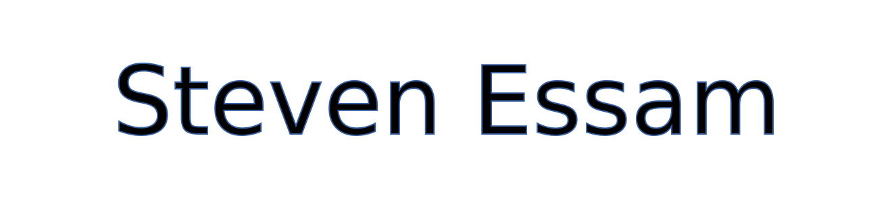

# Hi there, I'm Steven Essam! 👋

## About Me

- 🌱 I’m learning new technologies and frameworks.
- 🤔 I’m interested in Software Development and design.
- 💬 Ask me about anything tech-related!
- 📫 How to reach me: [Steven Essam Mail](mailto:steven.es.fr@gmail.com)

## My Projects

### [Stage_XR2C2_i3s](https://github.com/stevenessam/Stage_XR2C2_i3s)

- Web platform for preserving and showcasing extended reality projects, developed in collaboration with I3S and DS4H.

### [Stage_ACT_App_Inria](https://github.com/stevenessam/Stage_ACT_App_Inria)

- Mobile app for detecting and monitoring Wi-Fi networks, focusing on identifying contaminated areas using IoT technologies, developed in collaboration with Inria.

## Connect with Me

- [LinkedIn](https://www.linkedin.com/in/stevenessam/)