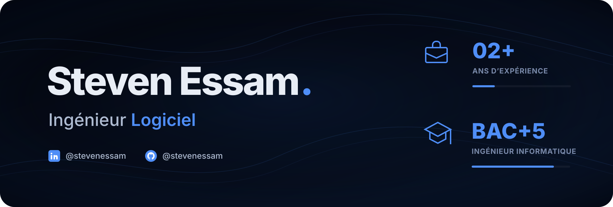

 

<table width="100%" cellspacing="24" cellpadding="18" border="0" frame="void" rules="none" style="border: none;">
  <tr>
    <td width="50%" align="center" style="border: none;">
      <h3>⚙️ Back-end et cloud</h3>
      
       Java · Spring Boot · Python · AWS
    </td>
    <td width="50%" align="center" style="border: none;">
      <h3>📱 Front-end et mobile</h3>
      
       Angular · React · Flutter · Kotlin
    </td>
  </tr>
  <tr>
    <td width="50%" align="center" style="border: none;">
      <h3>🗄️ Bases de données</h3>
      
      &nbsp;&nbsp;
      
       MySQL · MongoDB · PostgreSQL · InfluxDB
    </td>
    <td width="50%" align="center" style="border: none;">
      <h3>🛠️ Outils et méthodes</h3>
      
      &nbsp;&nbsp;
      
      &nbsp;&nbsp;
      
       Docker · Git · Jira · Confluence
    </td>
  </tr>
  <tr>
    <td colspan="2" align="center" style="border: none;">
      <h3>📡 Internet of Things (IoT)</h3>
      
      &nbsp;&nbsp;&nbsp;
      
      &nbsp;&nbsp;&nbsp;
      
       MQTT · ESP32 · Raspberry Pi · Arduino
    </td>
  </tr>
</table>

